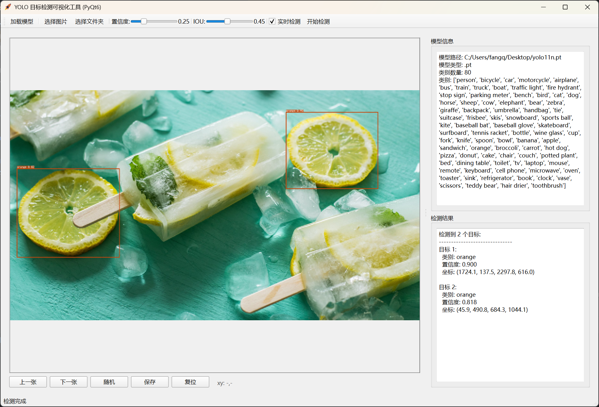

# YOLO目标检测可视化工具 (PyQt6)

本项目是一个基于 PyQt6 和 YOLO 的图形化目标检测工具，支持加载YOLO模型，对单张图片或文件夹批量图片进行目标检测，并可实时调整参数、查看检测结果和保存标注图片。



## 功能特性

- 支持加载 YOLO (ultralytics) 模型（.pt 或 .onnx 格式）

- 支持单张图片检测和文件夹批量检测

- 支持检测参数（置信度、IOU）实时调节

- 支持检测结果可视化与保存

- 支持图片缩放、拖拽、复位、随机切换

- 检测结果详细展示（类别、置信度、坐标等）

- 支持中文类别名显示（内置字体）

## 安装方法

1. 克隆仓库并进入目录

```shell
git clone <your-repo-url>

cd YoloPreview
```

2. 安装依赖

```shell
uv sync
```

## 使用说明

1. 运行程序

```shell
uv run main.py
```

2. 加载模型

   1. 点击工具栏“加载模型”，选择你的YOLO模型文件（支持.pt或.onnx）。

3. 选择图片或文件夹

   - “选择图片”：检测单张图片

   - “选择文件夹”：批量检测文件夹下所有图片

4. 参数调节与检测

   - 可通过滑块调整置信度和IOU阈值

   - 勾选“实时检测”可自动响应参数变化

   - 点击“开始检测”进行目标检测

5. 结果查看与保存

   - 检测结果会在右侧显示

   - 可保存带有检测框的图片