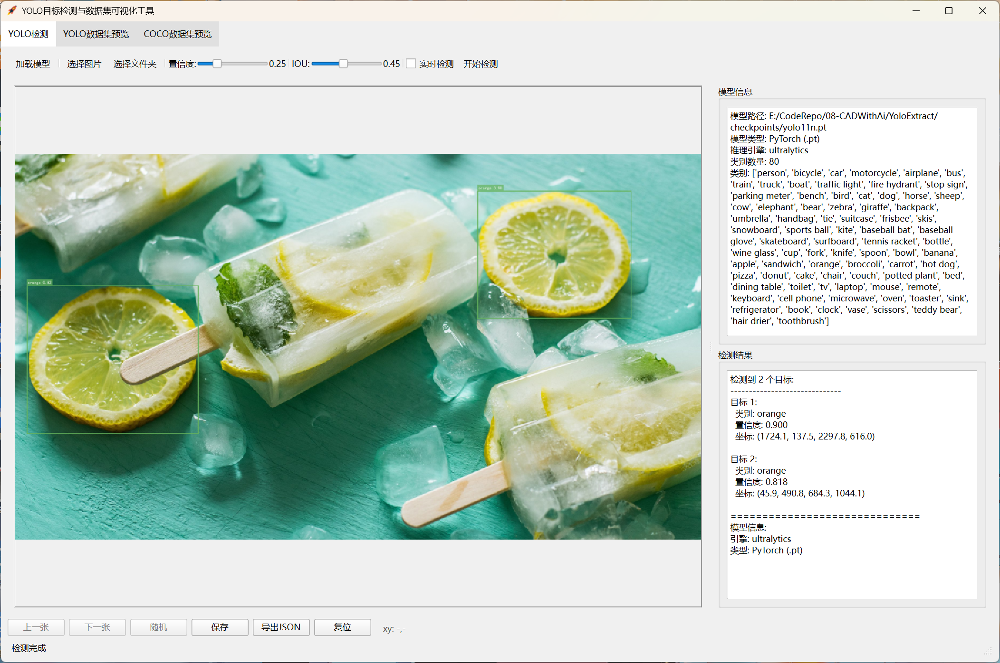
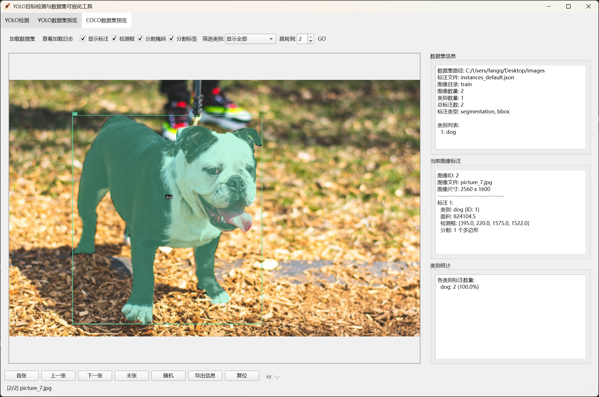

# YOLO目标检测与数据集可视化工具（PyQt6）

本项目是一个基于 PyQt6 的多功能目标检测与数据集可视化工具，支持 YOLO（ultralytics）模型推理、COCO/YOLO 格式数据集浏览、检测结果与数据集信息导出等丰富功能。适合模型测试、数据集分析、标注检查等多种场景。

<table>
    <tr>
        <td>
        	
        </td>
        <td>
        	
        </td>
    </tr>
    <tr>
        <td>
        	
        </td>
        <td>
        	
        </td>
    </tr>
</table>

---

## 主要功能

### 1. YOLO目标检测
- **支持模型格式**：可加载 YOLO（ultralytics）模型（`.pt` 或 `.onnx`）。
- **推理方式**：支持单张图片检测与文件夹批量检测。
- **参数调节**：可实时调整置信度（Confidence）与 IOU 阈值，支持“实时检测”模式。
- **检测结果可视化**：检测框、类别、置信度、坐标等信息直观展示。
- **结果导出**：检测图片可保存为图片文件，检测结果可一键导出为 JSON 文件。
- **图片操作**：支持图片缩放、拖拽、复位、随机切换、上一张/下一张浏览。
- **中文类别名显示**：内置中文字体，支持中文类别名。

### 2. YOLO数据集浏览
- **自动识别数据集结构**：支持常见 YOLO 数据集目录结构和配置文件（`data.yaml`等）。
- **分割浏览**：支持 train/val/test/all 等分割切换。
- **标注可视化**：支持显示/隐藏标注框，类别筛选，标注信息详细展示。
- **类别统计**：自动统计各类别标注数量及占比。
- **数据集信息导出**：一键导出数据集结构、类别、统计信息、文件列表为 JSON。
- **图片操作**：支持首张/末张/上一张/下一张/随机浏览，跳转指定图片。

### 3. COCO数据集浏览
- **COCO格式解析**：自动识别 COCO 标注文件（`instances.json`等），支持多种命名。
- **多类型标注显示**：支持检测框（bbox）、分割掩码（segmentation）、分割标签显示。
- **类别筛选与统计**：支持按类别筛选显示，统计各类别标注数量。
- **数据集信息导出**：一键导出 COCO 数据集结构、类别、统计信息、图片列表为 JSON。
- **图片操作**：同 YOLO 数据集浏览，支持多种浏览方式。

---

## 安装方法

1. 克隆仓库并进入目录
   ```shell
   git clone https://github.com/HeMOua/YoloPreview
   cd YoloPreview
   ```

2. 安装依赖（推荐使用 [uv](https://github.com/astral-sh/uv)）
   ```shell
   uv sync
   ```

---

## 使用说明

### 1. 启动程序
```shell
uv run main.py
```

### 2. 主要界面与操作

#### YOLO目标检测
- 点击工具栏“加载模型”，选择 `.pt` 或 `.onnx` 文件。
- “选择图片”检测单张图片，“选择文件夹”批量检测。
- 调整置信度/IOU滑块，或勾选“实时检测”自动响应参数变化。
- 点击“开始检测”进行推理，检测结果右侧展示。
- 可保存检测图片或导出 JSON 结果。

#### YOLO数据集浏览
- 点击“加载数据集”，选择数据集根目录。
- 支持分割切换、类别筛选、显示/隐藏标注。
- 底部可浏览图片、导出数据集信息、复位视图。
- 侧边栏展示数据集结构、当前图片标注、类别统计。

#### COCO数据集浏览
- 点击“加载数据集”，选择 COCO 数据集根目录。
- 自动识别标注文件和图片目录。
- 支持检测框、分割掩码、分割标签显示与隐藏。
- 类别筛选、统计、导出等功能同上。

---

## 依赖环境

- Python 3.12+
- PyQt6
- OpenCV
- onnxruntime
- ultralytics
- 其他依赖详见 `pyproject.toml`

---

## 常见问题

- **模型加载失败**：请确认模型文件格式正确，且依赖已安装齐全。
- **图片/数据集无法显示**：请检查路径、文件权限及数据集结构。
- **中文显示异常**：已内置字体，若仍有问题请检查系统字体支持。

---

## 许可证

本项目基于 MIT License 开源。

---

如需更多帮助或有建议，欢迎提交 Issue 或 PR！